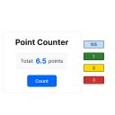

# Sticky Point Widget

これは、FigJam上で付箋にポイントを付け、その合計をカウントするためのウィジェットです。



## 主な機能

- **ポイントタグ付け**: 付箋や図形にポイント（数値）をタグとして付けられます。
- **自動集計**: 範囲内のポイントを自動で集計し、合計値を表示します。
- **カスタマイズ**: タグの色やサイズを自由に変更できます。

## 使い方

1.  **ウィジェットの追加**: FigJamのツールバーから「Sticky Point」ウィジェットを選択してボードに追加します。
2.  **タグ付け**:
    -   ウィジェットを付箋などのオブジェクトにドラッグ＆ドロップして追従させます。
    -   ウィジェット中央の数値をクリックして、ポイントを入力します。
3.  **集計**:
    -   プロパティメニューから `widgetType` を `Counter Tool` に変更します。
    -   集計したい範囲を選択するか、セクション内にカウンターを配置すると、自動でポイントが合計されます。

## 開発者向け情報

### セットアップ

このウィジェットはTypeScriptとNPMを使用しています。

1.  **依存関係のインストール**:
    ```bash
    npm install
    ```

2.  **ビルド**:
    ```bash
    npm run build
    ```

3.  **開発モード**:
    ```bash
    npm run watch
    ```

より詳細な開発者向けの情報は、`docs/DEVELOPER.md` を参照してください。